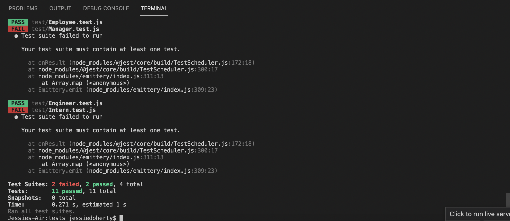
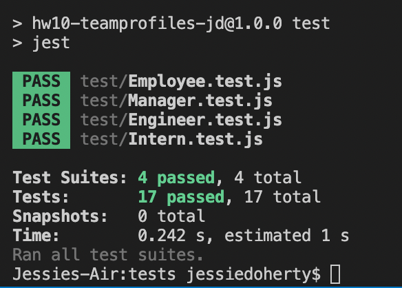

# hw10-TeamProfiles-JD

# Team Profile Builder

    Designed by: Jessie Doherty

## Description

    This app helps a manager build his/her team, including a manager, surbordinate engineers and interns.

    - What was your motivation?
    - Answer: This app combines back-end nodejs app and the front-end index.html page, it allows the manager to easily build a team, add contact infromation, add background information, etc.
    - Why did you build this project?
    - Answer: Help with internal human resources management in a corporation.
    - What problem does it solve?
    - Answer: Build a team, show background information and contact information for the manager, to ensure an easy and seamless managing process.
    - What did you learn?
    - Answer: node.js app, linking front-end and back-end, using jest package for basic testing, writing JavaScript classes and subclasses, etc.

## Installation

    Please tell us the 3 simple steps for installing your app.

    - Step 1: run index.js in node.js server
    - Step 2: Adding a manager, engineers and interns to a team.
    - Step 3: Check the generated html file and save it to your browser.

## Usage

    - This app requires VS code, node.js, inquire package and jest test package to run smoothly.

    - Screenshots of the tests

    Testing-debugging:
    

    Testing-passed:
    

## Credits

    Collaborators:

    - Name: No.; GitHub Repo: N/A.
    - Name: No.; GitHub Repo: N/A.

    Third-party assets:

    - No.

    Tutorials:

    - N/A

## License

    MIT License

    Copyright (c) May 2022 Jessie Doherty

    Permission is hereby granted, free of charge, to any person obtaining a copy
    of this software and associated documentation files (the "Software"), to deal
    in the Software without restriction, including without limitation the rights
    to use, copy, modify, merge, publish, distribute, sublicense, and/or sell
    copies of the Software, and to permit persons to whom the Software is
    furnished to do so, subject to the following conditions:

    The above copyright notice and this permission notice shall be included in all
    copies or substantial portions of the Software.

    THE SOFTWARE IS PROVIDED "AS IS", WITHOUT WARRANTY OF ANY KIND, EXPRESS OR
    IMPLIED, INCLUDING BUT NOT LIMITED TO THE WARRANTIES OF MERCHANTABILITY,
    FITNESS FOR A PARTICULAR PURPOSE AND NONINFRINGEMENT. IN NO EVENT SHALL THE
    AUTHORS OR COPYRIGHT HOLDERS BE LIABLE FOR ANY CLAIM, DAMAGES OR OTHER
    LIABILITY, WHETHER IN AN ACTION OF CONTRACT, TORT OR OTHERWISE, ARISING FROM,
    OUT OF OR IN CONNECTION WITH THE SOFTWARE OR THE USE OR OTHER DEALINGS IN THE
    SOFTWARE.

    ---

## 🏆 Miscellaneous

    ## Badges

    

## Features

    - Building a small team with ease.

## How to Contribute

    - This app and Github repo is open to the public to contribute.

## Demo URL

    Please feel free to take a look at the demo video of this app:

    [Demo link](https://drive.google.com/file/d/1PMw6HrfYfTd0uDhtfg4vlzsGgRSwDm-5/view)
